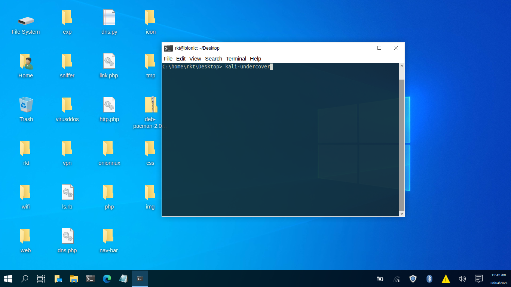

<!DOCTYPE html>
<html>
<head>
<title>Solution</title>
<link rel="stylesheet" href="style.css">
</head>
<body>
<h1> How to install kali linux undercover mode in any linux?</h1>
 

<h1>RKT(Rahat Khan Tusar)</h1>

 
<h4> Solution:</h4>
 

<a href="https://github.com/r3k4t/kali-mirrorlist">KALI LINUX REPOSITORY</a>

 
 
 
<ul>
<li>1.At first,add a kali linux repository in your linux sources.list.(Terminal Command:sudo mousepad  /etc/apt/sources.list)</li>
<li>2.update your linux.(Terminal Command:sudo apt update)</li>
<li>3.kali-undercover-mode(Terminal Command:sudo apt install kali-undercover)</li>
<li>4.kali-undercover</li>
</ul>
 
<h4>Screenshot:</h4>
 

</body>
</html>

